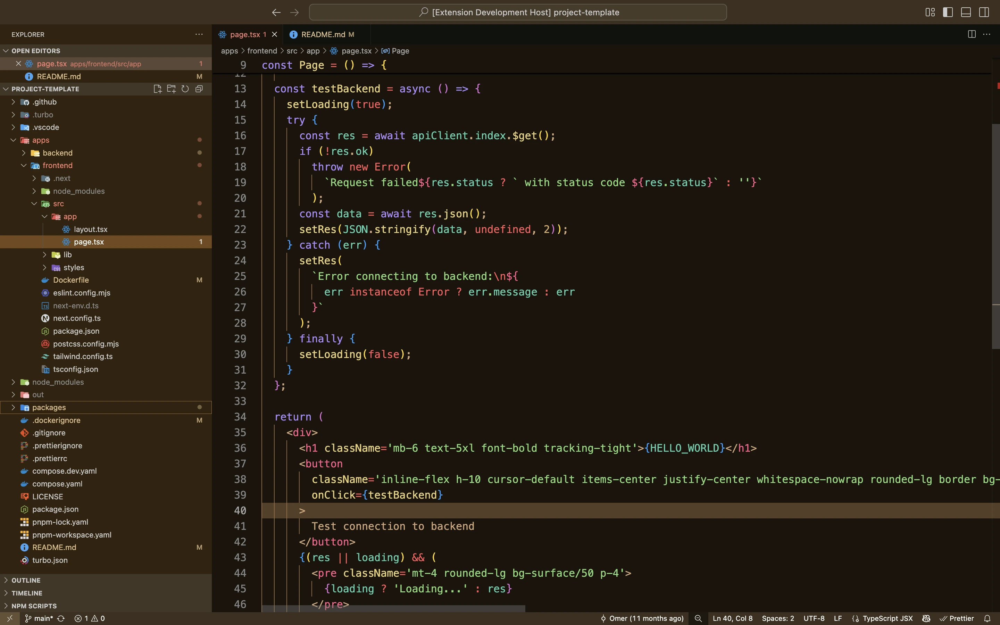

# West Coast Theme

A VS Code theme inspired by Kimbie and Andromeda color schemes, designed for developers with sensitive eyes.

## Overview

West Coast Theme combines:

- Warm background colors inspired by **Kimbie**
- Vibrant syntax highlighting inspired by **Andromeda**

This combination reduces blue light exposure while maintaining excellent code readability with custom modifications for a fresh coding experience.

## Why West Coast?

- **Eye-friendly**: Warm background colors reduce eye strain and blue light exposure
- **Enhanced readability**: Custom syntax colors provide clear, vibrant highlighting
- **Personal solution**: Created to address readability challenges while keeping colors lively and engaging

## Credits

This theme draws inspiration from:

- **Kimbie** - for warm, earthy background colors
- **Andromeda** - for syntax highlighting concepts

## Installation

Install from the VS Code Marketplace or download from GitHub releases.

## Screenshots

## Contributing

This is a personal theme, but feel free to fork and adapt it for your own needs.

## License

MIT
